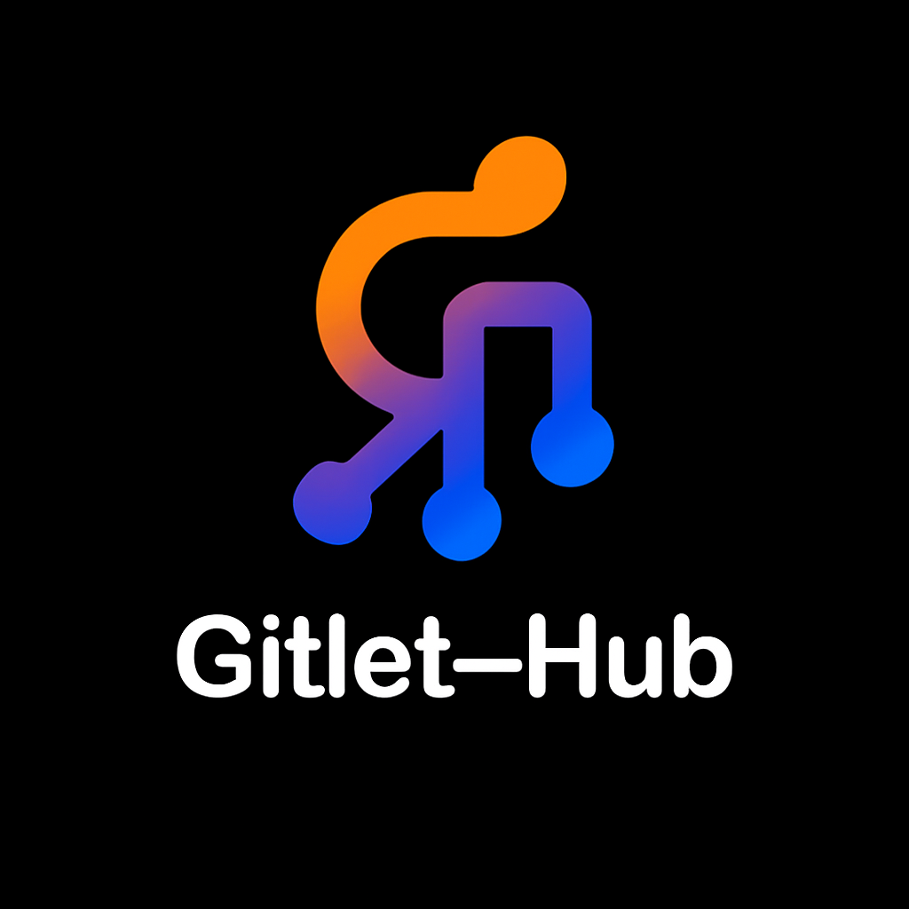

<div align="center">
    
    <h1 style="margin: 0; padding: 0; font-size: 24px;">Gitlet Hub</h1>
</div>

<p align="center">
  
  
</p>

Gitlet Hub is a GitHub-like platform built upon a custom version control system called Gitlet. It aims to help developers deeply understand the internals of version control systems and develop full-stack skills. This project is entirely built with Java and React, providing RESTful APIs and a modern, user-friendly frontend.

## Project Structure

This project uses a multi-module design, managed by Maven and npm/vite:

* **gitlet-core**: Core Java library providing Git-like fundamental operations (commit, branch, checkout, etc.).
* **gitlet-transport**: Built on the core library, handles Git protocol-related operations (push, pull, clone).
* **gitlet-server**: Spring Boot backend server handling user authentication, permission management, business logic, and REST APIs.
* **gitlet-web**: React frontend providing a friendly user interface.

```
gitlet-hub
├── gitlet-core        (Java core library)
├── gitlet-transport   (Git protocol module)
├── gitlet-server      (Spring Boot backend)
└── gitlet-web         (React frontend)
```

## Tech Stack

* **Backend**:

    * Java 21
    * Spring Boot 3.5.0
    * Spring Data JPA
    * Spring Security (JWT)
    * PostgreSQL
    * Maven

* **Frontend**:

    * React
    * TypeScript
    * Axios
    * Vite
    * Tailwind CSS

## Quick Start

### Backend

```bash
# Build and start backend
cd gitlet-server
mvn clean install
mvn spring-boot:run
```

### Frontend

```bash
# Install dependencies and start frontend
cd gitlet-web
npm install
npm run dev
```

## Features and Roadmap

### Implemented

* Core Gitlet functionalities (commit, checkout, branch, etc.)
* Initial project structure and dependency setup

### Planned Development

* Implement git push/pull via HTTP protocol
* User login and permission management
* Repository display and collaboration (Pull Requests, Issues)
* UI enhancement
* Docker containerization
* CI/CD automation

## License

This project is licensed under the GPL-3.0 License - see [LICENSE](LICENSE) for details.
